# SDD - Software Design Description

## Overview

This folder contains **Software Design Descriptions (SDD)** following the SDD
standard. Each feature or significant change MUST have a corresponding SPEC
document created BEFORE any implementation begins.

The SPEC serves as:

- **Human review document** — stakeholders and reviewers can understand the
  feature without reading code
- **Business logic contract** — no code, only logic and decisions
- **Test planning** — test cases derived from the spec, not from implementation
- **TDD contracts** — every test case follows RED-GREEN-REFACTOR cycle

---

## Document Metadata

```yaml
spec_id: SDD-{YYYY}-{NNN}
title: "{Feature Name}"
author: "{Author Name}"
date: "{YYYY-MM-DD}"
status: Draft | In Review | Approved | Implemented
priority: Critical | High | Medium | Low
type: Feature | Bug Fix | Refactor | Enhancement
related_issues: []
related_specs: []
```

---

## 1. Introduction

### 1.1 Purpose

Describe **why** this feature exists. What business problem does it solve? What
user need does it address?

### 1.2 Scope

Define what is **IN SCOPE** and what is **OUT OF SCOPE**.

**In Scope:**

- List what will be built

**Out of Scope:**

- List what will NOT be built in this iteration
- Future considerations

### 1.3 Definitions & Abbreviations

| Term | Definition |
| ---- | ---------- |
|      |            |

### 1.4 References

- Related documents, specs, or requirements
- API contracts or external dependencies
- `test-driven-development` skill — MUST be read before writing implementation
- `@testing-anti-patterns.md` — MUST be read before writing mocks

---

## 2. Proposed Folder Structure

Describe the **proposed file and folder structure** for this feature. This
section MUST be reviewed and approved BEFORE any implementation begins.

### 2.1 New Files & Directories

List all new files and directories to be created.

```
src/
└── features/
    └── {feature-name}/
        ├── api/                     # API definitions
        │   ├── {feature}-api.ts
        │   └── {feature}-api.test.ts  ← TDD unit tests (colocated)
        ├── components/              # Feature-specific components
        │   ├── {Feature}Form.tsx
        │   ├── {Feature}List.tsx
        │   └── {Feature}Item.tsx
        ├── hooks/                  # Feature hooks
        │   ├── use{Feature}.ts
        │   └── use{Feature}Mutations.ts
        ├── types/                   # Feature types
        │   └── {feature}-types.ts
        ├── utils/                   # Feature utilities
        │   ├── {feature}-utils.ts
        │   └── {feature}-utils.test.ts  ← TDD unit tests (colocated)
        ├── {feature}.query-options.ts   # React Query options
        └── index.ts                 # Public exports
```

### 2.2 Modified Files

List all existing files that will be modified.

| File                    | Modification Type | Description      |
| ----------------------- | ----------------- | ---------------- |
| `src/app/layout.tsx`    | Modify            | Add new provider |
| `src/lib/api-client.ts` | Modify            | Add new endpoint |
|                         |                   |                  |

### 2.3 Deleted Files

List files to be removed (if any).

| File | Reason |
| ---- | ------ |
|      |        |

### 2.4 Folder Structure Checklist

Before approving this section, verify:

- [ ] Folder structure follows **feature-based architecture** (see
      `frontend-arch` skill)
- [ ] No shared components will contain business logic
- [ ] Tests are **colocated** with the code they test (`.test.ts` next to `.ts`)
- [ ] API definitions are in `features/{name}/api/`
- [ ] React Query follows 3-layer pattern: pure function → query options → hook
- [ ] Types are defined in `features/{name}/types/`
- [ ] No cross-feature imports (features should be self-contained)
- [ ] **Test files exist** for every `.ts` file with logic (utils, api functions)

### 2.5 Architecture Decisions

Document any architectural decisions or trade-offs for this feature.

| Decision                     | Options Considered                   | Chosen Approach | Rationale  |
| ---------------------------- | ------------------------------------ | --------------- | ---------- |
| Where to store feature state | React Query / Zustand / Context      | React Query     | Because... |
| Component strategy           | Atomic / Container-Presenter / Mixed | Atomic          | Because... |
|                              |                                      |                 |            |

---

## 3. User Interactions & Flows

### 3.1 User Stories

| ID    | As a... | I want to... | So that... | Priority    |
| ----- | ------- | ------------ | ---------- | ----------- |
| US-01 |         |              |            | Must Have   |
| US-02 |         |              |            | Should Have |
| US-03 |         |              |            | Could Have  |

### 3.2 User Flows

Describe each major user interaction as a **step-by-step flow without UI code**.

```
Flow: {Flow Name}
Actor: {User Type}

Step 1: User performs {action}
Step 2: System {response/behavior}
Step 3: User performs {action}
...
End: {Final state / outcome}
```

### 3.3 Error Flows

```
Flow: {Error Flow Name}
Trigger: {What causes this error}

Step 1: User performs {action}
Step 2: System {error behavior}
Step 3: User {recovery action} (if recoverable)
End: {Final state}
```

---

## 4. Functional Requirements

### 4.1 Core Features

#### Feature F-01: {Feature Name}

**Description:** What this feature does in plain language.

**Business Rules:**

- Rule 1: {rule}
- Rule 2: {rule}
- Rule N: {rule}

**Inputs:**

| Field | Type | Required | Validation |
| ----- | ---- | -------- | ---------- |
|       |      |          |            |

**Outputs:**

| Field | Type | Description |
| ----- | ---- | ----------- |
|       |      |             |

**Side Effects:**

- List any state changes, API calls, or system behaviors triggered

---

## 5. Data Model

### 5.1 Domain Entities

```
{EntityName}
├── field1: {type} — {description}
├── field2: {type} — {description}
└── relationships
    ├── has many: {RelatedEntity}
    └── belongs to: {RelatedEntity}
```

### 5.2 State Machine (if applicable)

```
{StateName}
├── State A — (initial)
│   └── trigger: {event} → State B
├── State B
│   └── trigger: {event} → State C
└── State C — (final)
```

---

## 6. Edge Cases & Error Handling

### 6.1 Edge Cases

| ID    | Scenario | Expected Behavior | Severity |
| ----- | -------- | ----------------- | -------- |
| EC-01 |          |                   | High     |
| EC-02 |          |                   | Medium   |

### 6.2 Error Handling Matrix

| Error Condition | User Message | System Action | Logging |
| --------------- | ------------ | ------------- | ------- |
|                 |              |               |         |

---

## 7. Non-Functional Requirements

| ID     | Requirement   | Acceptance Criteria |
| ------ | ------------- | ------------------- |
| NFR-01 | Performance   |                     |
| NFR-02 | Security      |                     |
| NFR-03 | Accessibility |                     |
| NFR-04 | Compatibility |                     |

---

## 8. Unit Test Cases (TDD)

> **TDD Required:** Every test case below must be implemented using RED-GREEN-REFACTOR cycle.
> Read `test-driven-development` skill before writing any implementation code.

### 8.1 The Iron Law

```
NO PRODUCTION CODE WITHOUT A FAILING TEST FIRST
```

Write code before the test? **Delete it. Start over.**

**No exceptions:**
- Don't keep it as "reference"
- Don't "adapt" it while writing tests
- Don't look at it
- Delete means delete

### 8.2 RED-GREEN-REFACTOR per Test Case

For each test case, you MUST follow this exact sequence:

```dot
digraph test_case_flow {
    rankdir=LR;
    red [label="RED\nWrite failing test first", shape=box, style=filled, fillcolor="#ffcccc"];
    run_red [label="Run test\nVerify it FAILS", shape=diamond];
    green [label="GREEN\nWrite minimal code", shape=box, style=filled, fillcolor="#ccffcc"];
    run_green [label="Run test\nVerify it PASSES", shape=diamond];
    refactor [label="REFACTOR\n(if needed)", shape=box, style=filled, fillcolor="#ccccff"];

    red -> run_red;
    run_red -> green [label="fails correctly"];
    run_red -> red [label="wrong failure"];
    green -> run_green;
    run_green -> refactor [label="passes"];
    run_green -> green [label="still fails"];
}
```



### 8.3 Test File Location

Tests are **colocated** with the code they test:

```
src/features/<feature-name>/
├── utils/
│   ├── parser.ts
│   └── parser.test.ts    ← TDD unit tests
├── api/
│   ├── transform.ts
│   └── transform.test.ts  ← TDD unit tests
```

### 8.4 Test Case Template

For each test case (TC-XX), document:

```markdown
#### TC-XX: {Test Name}

**Given** (setup):
> Description of initial state

**When** (action):
> The action being tested

**Then** (assertion):
> Expected outcome

---

**[RED]** Write the failing test:

```typescript
// src/features/<name>/utils/<name>.test.ts
test('TC-XX: {Test Name}', () => {
  // Given: setup
  // When: action
  // Then: assertion
});
```

**[RED]** Run test, verify it fails with expected error.

**[GREEN]** Write minimal implementation.

**[GREEN]** Run test, verify it passes.

**[REFACTOR]** (optional) Clean up if needed, keep tests green.
```

### 8.5 Anti-Patterns Warning

**Read before writing mocks:** `@testing-anti-patterns.md`

Common violations that break TDD:

| Violation | Why Wrong | Prevention |
|-----------|-----------|------------|
| Test mock behavior instead of real behavior | Test proves nothing about production | Don't assert on mock internals |
| Partial mock (missing fields) | Silent failures at integration | Mirror real API structure completely |
| Test-only methods in production code | Pollutes production with test code | Move to test utilities |
| Mock without understanding dependencies | Breaks behavior test depends on | Understand dependency chain first |

### 8.6 Test Case Registry

| ID | File | Description | Status |
|----|------|-------------|--------|
| TC-01 | | | RED |
| TC-02 | | | RED |

### 8.7 TDD Verification Checklist

Before marking a test case complete, verify:

- [ ] **RED:** Test written first, before any implementation code
- [ ] **RED:** Ran test, confirmed it FAILS with expected error
- [ ] **RED:** Failure is because feature is missing (not typo in test)
- [ ] **GREEN:** Wrote minimal code to pass the test
- [ ] **GREEN:** Ran test, confirmed it PASSES
- [ ] **GREEN:** No other existing tests broke
- [ ] **REFACTOR:** Cleaned up if needed, tests stayed green
- [ ] **Anti-pattern check:** No testing mock behavior, no partial mocks

---

## 9. Integration & E2E Test Cases

### 9.1 API Route Tests

| ID | File | Description | Status |
|----|------|-------------|--------|
| TC-API-01 | | | Pending |
| TC-API-02 | | | Pending |

### 9.2 Browser Test Scenarios

See Section 9 for browser testing instructions.

---

## 10. Dependencies

### 10.1 External Dependencies

| Dependency | Version | Purpose | Owner |
| ---------- | ------- | ------- | ----- |
|            |         |         |       |

### 10.2 Internal Dependencies

| Component | Relationship | Notes |
| --------- | ------------ | ----- |
|           |              |       |

---

## 11. Acceptance Criteria

### 11.1 Success Conditions

- [ ] Criterion 1
- [ ] Criterion 2
- [ ] Criterion N

### 11.2 Definition of Done Checklist

- [ ] Folder structure reviewed and approved
- [ ] SPEC reviewed and approved by at least one reviewer
- [ ] All test cases defined and executable
- [ ] No code written before SPEC approval
- [ ] Implementation matches SPEC exactly
- [ ] All TDD unit tests follow RED-GREEN-REFACTOR cycle
- [ ] Each test verified RED before GREEN
- [ ] All integration tests pass
- [ ] No hard rules violations (see AGENTS.md)
- [ ] TypeScript build passes
- [ ] ESLint passes

---

## 12. Review & Approval

### 12.1 Folder Structure Review

> **Important:** Folder structure MUST be reviewed and approved BEFORE any code
> is written.

| Reviewer | Status  | Comments |
| -------- | ------- | -------- |
|          | Pending |          |
|          |         |          |

**Approval Gate:** All items in the Folder Structure Checklist (Section 2.4)
must be checked before proceeding to implementation.

### 12.2 Full Document Review

| Role       | Name | Date | Signature |
| ---------- | ---- | ---- | --------- |
| Author     |      |      |           |
| Reviewer 1 |      |      |           |
| Reviewer 2 |      |      |           |
| Approver   |      |      |           |

### 12.3 Review Notes

自由格式的审查注释和建议

---

## 13. Revision History

| Version | Date       | Author | Changes       |
| ------- | ---------- | ------ | ------------- |
| 0.1     | YYYY-MM-DD |        | Initial draft |
|         |            |        |               |
