# [Feature Name] Implementation Plan

**Goal:** [One sentence describing what this builds]

**Architecture:** [2-3 sentences about approach]

**Tech Stack:** [Key technologies/libraries]

---

> **Spec:** [link to spec.md]
> **Status:** Draft | Review | Approved
> **Author:** <name>
> **Date:** YYYY-MM-DD

---

## 1. Architecture Overview

### 1.1 System Context
<!-- High-level diagram or description of how this feature fits into the system -->

### 1.2 Component Interaction
<!-- Data flow: Client → Module → Internal Service → DB / Queue -->

```
<component A> → <component B> → <component C>
```

---

## 2. Tech Stack & Dependencies

| Category | Choice | Version | Rationale |
|----------|--------|---------|-----------|
| Framework | | | |
| Library | | | |
| Database | | | |
| Queue/Worker | | | |

### 2.1 New Dependencies
<!-- List any new packages to install -->

- `<package-name>`: <reason>

### 2.2 Existing Modules Used (read-only)
<!-- List existing modules this feature will read from -->

- `<module-name>`: <what's used>

---

## 3. Data Model

### 3.1 Schema Design
<!-- Column names, types, indexes — NOT full migration code -->

**Table: `<table_name>`**

| Column | Type | Nullable | Index | Notes |
|--------|------|----------|-------|-------|
| `id` | uuid | No | PK | |
| `name` | varchar(255) | No | | |
| `metadata` | jsonb | Yes | | Flexible data |
| `createdAt` | timestamp | No | | |
| `updatedAt` | timestamp | No | | |

### 3.2 Relationships
<!-- FK, 1:N, M:N — describe, don't implement -->

- `<table_a>` 1:N `<table_b>` via `<fk_column>`

### 3.3 Migration Strategy
<!-- What migrations are needed, any data migration -->

- [ ] Create `<table_name>` table
- [ ] Add index on `<column>`

---

## 4. API Contracts

### 4.1 Endpoints

**`<METHOD> /<path>`**

| Aspect | Detail |
|--------|--------|
| Auth | Required / Public |
| Request Body | `{ "field": "type", ... }` |
| Response 200 | `{ "data": {...}, "message": "..." }` |
| Response 4xx | `{ "code": "ERROR_CODE", "message": "..." }` |
| Queue | Yes/No → Queue name |

### 4.2 MCP Tools (if applicable)

**Tool: `<toolName>`**

| Aspect | Detail |
|--------|--------|
| Type | Tool / Resource |
| Input | `{ "param": "type" }` |
| Output | `{ "content": [...], "structuredContent": {...} }` |
| URI (resource) | `geotools://<module>/<type>` |

---

## 5. Internal Service Design

### 5.1 Service Interfaces
<!-- Factory function signatures, input/output types — NO implementation -->

```typescript
// Factory signature
export const create<Name>Service = (deps?: Deps) => ({
  <methodName>: (input: InputType) => Promise<OutputType>,
})
```

### 5.2 Service Composition
<!-- How services call each other -->

```
Module Service → Internal Service A → Internal Service B → Repo
```

### 5.3 Queue Design (if applicable)

| Queue Name | Job Type | Worker | Retry |
|------------|----------|--------|-------|
| `<queue-name>` | `<job-type>` | `<worker-name>` | 3 |

---

## 6. Error Handling

| Error Code | HTTP Status | Scenario | Response |
|------------|-------------|----------|----------|
| `<CODE>` | 400 | <when> | <message> |
| `<CODE>` | 404 | <when> | <message> |
| `<CODE>` | 500 | <when> | <message> |

---

## 7. Test Strategy

> **TDD Required:** Every task step must follow RED-GREEN-REFACTOR cycle.
> Read `test-driven-development` skill before writing implementation code.

### 7.1 RED-GREEN-REFACTOR per Task

Each implementation task MUST follow this sequence:

```dot
digraph task_tdd_flow {
    rankdir=LR;
    red [label="RED\nWrite failing test first", shape=box, style=filled, fillcolor="#ffcccc"];
    run_red [label="npm test\nVerify it FAILS", shape=diamond];
    green [label="GREEN\nWrite minimal code", shape=box, style=filled, fillcolor="#ccffcc"];
    run_green [label="npm test\nVerify it PASSES", shape=diamond];
    refactor [label="REFACTOR\n(if needed)", shape=box, style=filled, fillcolor="#ccccff"];

    red -> run_red;
    run_red -> green [label="fails correctly"];
    run_red -> red [label="wrong failure"];
    green -> run_green;
    run_green -> refactor [label="passes"];
    run_green -> green [label="still fails"];
}
```



### 7.2 Task Step Format

Every task step must include TDD sub-steps:

```markdown
### Task N: {Task Name}

**Description:** What this builds

**Files:** `src/features/<name>/utils/<name>.ts`, `src/features/<name>/utils/<name>.test.ts`

---

**[RED]** Write failing test:

```typescript
// src/features/<name>/utils/<name>.test.ts
test('TC-XX: {Test Name}', () => {
  // Given: setup
  // When: action
  // Then: assertion
});
```

**[RED]** Run: `npm test src/features/<name>/utils/<name>.test.ts`
**Expected:** FAIL — "Cannot find module" or expected error

**[GREEN]** Write minimal implementation:

```typescript
// src/features/<name>/utils/<name>.ts
export function myFunction(input: string): string {
  return input;
}
```

**[GREEN]** Run: `npm test src/features/<name>/utils/<name>.test.ts`
**Expected:** PASS

**[REFACTOR]** (optional) Clean up if needed, keep tests green.
```

### 7.3 Anti-Patterns Warning

**Read before writing mocks:** `@testing-anti-patterns.md`

Common violations:

| Violation | Why Wrong | Prevention |
|-----------|-----------|------------|
| Test mock behavior instead of real behavior | Test proves nothing | Don't assert on mock internals |
| Partial mock (missing fields) | Silent integration failures | Mirror real API completely |
| Test-only methods in production | Pollutes production code | Move to test utilities |

### 7.4 Coverage Target

| Layer | What to Test | Minimum Coverage |
|-------|-------------|-----------------|
| Utils/Hooks | Business logic | 80% |
| API functions | Transform/export logic | 70% |
| Forms/Validation | Input validation | 90% |

---

## 8. Constraints & Trade-offs

### 8.1 Constraints
- <e.g., Must follow AGENTS.md conventions>
- <e.g., No changes to existing module structure>

### 8.2 Trade-offs
| Decision | Alternative | Why this choice |
|----------|-------------|-----------------|
| <choice> | <alt> | <reason> |

### 8.3 Out of Scope (Technical)
- <technical item not covered in this plan>

---

## 9. Change Log

| Date | Version | Changed By | Change Summary | Reason | Affected Sections |
|------|---------|------------|----------------|--------|-------------------|
| YYYY-MM-DD | v1.0 | <author> | Initial plan | — | All |
| | | | | | |

### Follow-ups

<!-- Track items discovered during implementation that were NOT in original plan -->

| Date | Item | Impact | Status |
|------|------|--------|--------|
| | | | Pending |

### Change Rules

1. Every change logged with version bump
2. Follow-ups section captures implementation discoveries
3. When follow-ups require code changes → implement directly
