# Feature: <feature-name>

> **Status:** Draft | Review | Approved
> **Author:** <name>
> **Date:** YYYY-MM-DD
> **Related Issues:** #

---

## 1. Problem Statement

### 1.1 User Problem

<!-- What pain point or need does this feature address? -->

### 1.2 Business Impact

<!-- Why does this matter? Quantify if possible. -->

### 1.3 Success Criteria

<!-- Measurable outcomes. Example: "Reduce search-related support tickets by 35%" -->

- [ ] <metric 1>
- [ ] <metric 2>

---

## 2. User Stories & Acceptance Criteria

### Story 1: <title>

**As a** <role>,
**I want** <action/functionality>,
**so that** <benefit/outcome>.

#### Acceptance Criteria

- **Given** <context/state>,
  **When** <action/event>,
  **Then** <expected result>.

- **Given** <context/state>,
  **When** <action/event>,
  **Then** <expected result>.

### Story 2: <title>

**As a** <role>,
**I want** <action/functionality>,
**so that** <benefit/outcome>.

#### Acceptance Criteria

- **Given** <context/state>,
  **When** <action/event>,
  **Then** <expected result>.

---

## 3. Functional Requirements

### 3.1 Core Behaviors

| ID | Requirement | Priority |
|----|-------------|----------|
| FR-1 | <description> | Must / Should / Could |
| FR-2 | <description> | Must / Should / Could |

### 3.2 Edge Cases

- <edge case 1: e.g., empty input, max limit>
- <edge case 2: e.g., concurrent access>

### 3.3 Error Handling

| Scenario | Expected Behavior |
|----------|-------------------|
| <error condition> | <how system responds> |
| <error condition> | <how system responds> |

---

## 4. Non-Functional Requirements

### 4.1 Performance

- Response time: <e.g., < 500ms for API calls>
- Throughput: <e.g., handle 100 req/s>

### 4.2 Security

- <e.g., input validation, auth requirements, data encryption>

### 4.3 Constraints

- Platform: <e.g., Deno runtime, Node.js compatibility>
- Dependencies: <list any>
- Compatibility: <list any>
- Integration: <e.g., must work with existing auth system>

---

## 5. Unit Test Cases (TDD)

> **TDD Required:** Every test case below must be implemented using RED-GREEN-REFACTOR cycle.
> Read `test-driven-development` skill before writing any implementation code.

### 5.1 The Iron Law

```
NO PRODUCTION CODE WITHOUT A FAILING TEST FIRST
```

Write code before the test? **Delete it. Start over.**

### 5.2 RED-GREEN-REFACTOR per Test Case

For each test case (TC-XX), you MUST follow this exact sequence:

```dot
digraph test_case_flow {
    rankdir=LR;
    red [label="RED\nWrite failing test first", shape=box, style=filled, fillcolor="#ffcccc"];
    run_red [label="Run test\nVerify it FAILS", shape=diamond];
    green [label="GREEN\nWrite minimal code", shape=box, style=filled, fillcolor="#ccffcc"];
    run_green [label="Run test\nVerify it PASSES", shape=diamond];
    refactor [label="REFACTOR\n(if needed)", shape=box, style=filled, fillcolor="#ccccff"];

    red -> run_red;
    run_red -> green [label="fails correctly"];
    run_red -> red [label="wrong failure"];
    green -> run_green;
    run_green -> refactor [label="passes"];
    run_green -> green [label="still fails"];
}
```



### 5.3 Test Case Registry

| ID | File | Description | Status |
|----|------|-------------|--------|
| TC-01 | | | RED |
| TC-02 | | | RED |

### 5.4 Test Case Template

```markdown
#### TC-XX: {Test Name}

**Given** (setup):
> Description of initial state

**When** (action):
> The action being tested

**Then** (assertion):
> Expected outcome

---

**[RED]** Write the failing test:

```typescript
// src/features/<name>/utils/<name>.test.ts
test('TC-XX: {Test Name}', () => {
  // Given: setup
  // When: action
  // Then: assertion
});
```

**[RED]** Run test, verify it fails with expected error.

**[GREEN]** Write minimal implementation.

**[GREEN]** Run test, verify it passes.

**[REFACTOR]** (optional) Clean up if needed, keep tests green.
```

### 5.5 Anti-Patterns Warning

**Read before writing mocks:** `@testing-anti-patterns.md`

Common violations that break TDD:

| Violation | Why Wrong | Prevention |
|-----------|-----------|------------|
| Test mock behavior instead of real behavior | Test proves nothing | Don't assert on mock internals |
| Partial mock (missing fields) | Silent integration failures | Mirror real API completely |
| Test-only methods in production code | Pollutes production | Move to test utilities |
| Mock without understanding dependencies | Breaks behavior test depends on | Understand dependency chain first |

### 5.6 TDD Verification Checklist

Before marking a test case complete, verify:

- [ ] **RED:** Test written first, before any implementation code
- [ ] **RED:** Ran test, confirmed it FAILS with expected error
- [ ] **RED:** Failure is because feature is missing (not typo in test)
- [ ] **GREEN:** Wrote minimal code to pass the test
- [ ] **GREEN:** Ran test, confirmed it PASSES
- [ ] **GREEN:** No other existing tests broke
- [ ] **REFACTOR:** Cleaned up if needed, tests stayed green
- [ ] **Anti-pattern check:** No testing mock behavior, no partial mocks

---

## 6. Boundaries

### [ALLOW] Always Do

- <e.g., Run tests before commits>
- <e.g., Follow naming conventions in AGENTS.md>

### [CAUTION] Ask First

- <e.g., Modifying database schemas>
- <e.g., Adding new dependencies>

### [FORBID] Never Do

- <e.g., Commit secrets or API keys>
- <e.g., Edit node_modules/ or vendor/>
- Write production code before writing test first

---

## 7. Verification

### 7.1 Test Plan

| Requirement | Test Method | TDD Status |
|-------------|-------------|------------|
| FR-1 | <unit test / integration test / manual> | Pending (RED) |
| FR-2 | <unit test / integration test / manual> | Pending (RED) |

### 7.2 Acceptance Checklist

- [ ] All user stories implemented
- [ ] All acceptance criteria met
- [ ] Edge cases handled
- [ ] Error responses match spec
- [ ] Performance targets achieved
- [ ] All TDD test cases follow RED-GREEN-REFACTOR cycle
- [ ] Each test verified RED before GREEN
- [ ] Tests pass with required coverage
- [ ] No boundary violations

---

## 8. Out of Scope

<!-- Explicitly list what this feature does NOT cover to prevent scope creep -->

- <item 1>
- <item 2>

---

## 9. Change Log

<!-- Track every change to this spec after initial creation. Keeps spec as a living document. -->

| Date | Version | Changed By | Change Summary | Reason | Affected Sections |
|------|---------|------------|----------------|--------|-------------------|
| YYYY-MM-DD | v1.0 | <author> | Initial spec | — | All |
| | | | | | |

### Change Rules

1. **Every change must be logged** — no silent edits
2. **Version format:** `v{major}.{minor}` — bump major for scope change, minor for clarification
3. **Reason must be explicit** — e.g., "User feedback", "Tech constraint discovered", "PM request"
4. **Affected sections must reference IDs** — e.g., "FR-3, AC-2, §4.1"
5. **Never delete old entries** — append only, history is audit trail

### Change Types

| Type | When to Use | Version Bump |
|------|-------------|--------------|
| **Clarification** | Ambiguous requirement made explicit | Minor |
| **Addition** | New requirement or acceptance criteria | Minor |
| **Removal** | Requirement explicitly dropped | Major |
| **Scope Change** | Feature boundaries expanded or reduced | Major |
| **Correction** | Factual error fixed | Minor |
